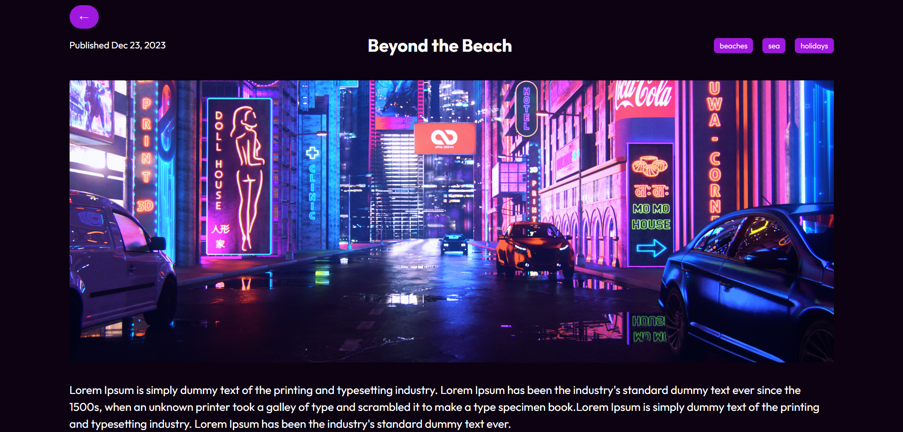

# React Blog Platform

Welcome to the React Blog Platform repository! This project is a React-based web application designed to serve as a platform for blogs. Built with React, it features functionality to search blogs by category and view individual blog pages. The modern UI design enhances the overall user experience, making it visually appealing and user-friendly.

## Preview

### 1. Showing All Blogs


### 2. Search By Category


### 2. Single Blog Page



## Features

- **Search by Category:** Easily find blogs by searching through categories.
- **Single Blog Pages:** View detailed pages for each individual blog.
- **Modern UI Design:** Sleek layout and visually appealing design for an enjoyable user interface.

## Getting Started

To run the React Blog Platform locally, follow these steps:

1. Clone the repository to your local machine:

   ```bash
   git clone https://github.com/Devsethi3/React-Blog-Platform.git
   ```

2. Navigate to the project directory:

   ```bash
   cd react-blog-platform
   ```

3. Install the dependencies:

   ```bash
   npm install
   ```

4. Start the development server:

   ```bash
   npm start
   ```

5. Open your web browser and visit [http://localhost:3000](http://localhost:3000) to explore the blog platform.

## Usage

1. Explore all available blogs by navigating to the homepage.
2. Use the search functionality to filter blogs by category.
3. Click on a blog to view its detailed page.

## Customization

Feel free to customize this project to fit your preferences. Update styles, colors, and layout directly in the React components and CSS files. You can also modify the blog data and categories by editing the JavaScript file (`blogs.js`). Additionally, you can extend the functionality to include more features or customization options.

## Contributing

If you'd like to contribute to this project, follow these steps:

1. Fork the repository.
2. Create a new branch for your feature or improvement.
3. Make your changes and commit them with descriptive messages.
4. Push your changes to your forked repository.
5. Open a pull request to merge your changes into the main branch.

Explore the React Blog Platform, discover interesting blogs, and consider contributing to its development. Thank you for checking out the repository!